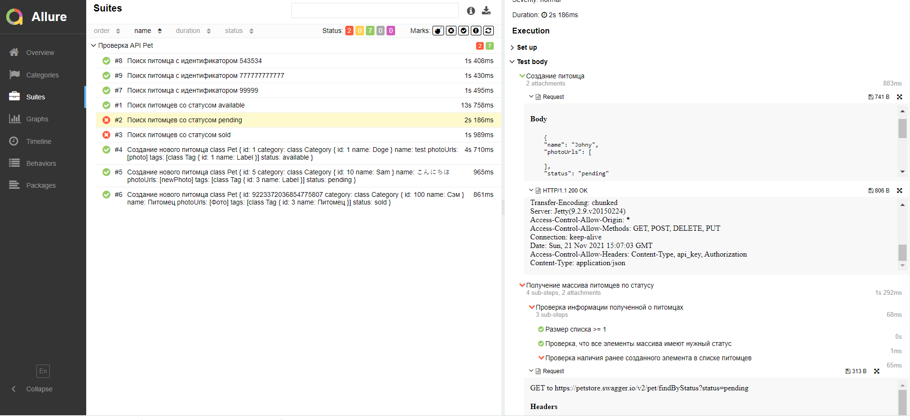

Для запуска тестов необходимо выполнить команды:
``` 
git clone https://github.com/daserok/example_of_api_tests.git
mvn clean compile # Для генерации API клиента
mvn test
mvn allure:serve # Для Генерация Allure Report после прохождения тестов
```

Пример Allure отчета:
